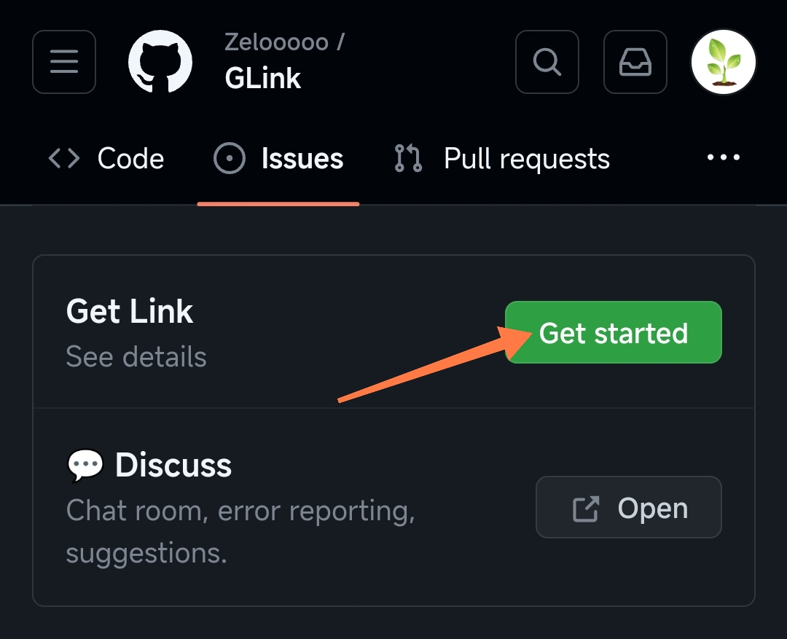
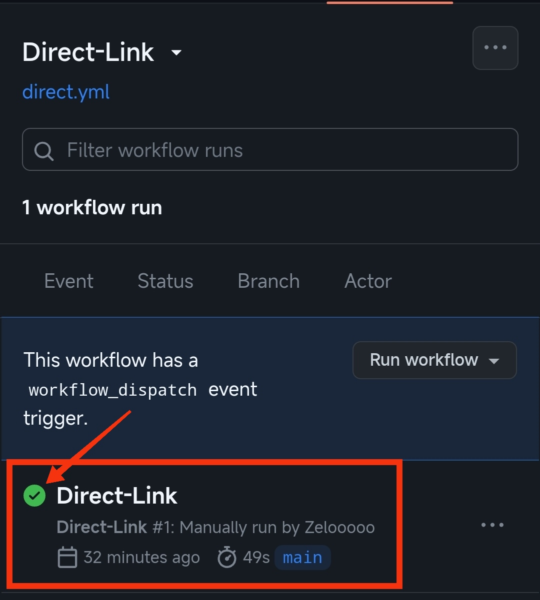
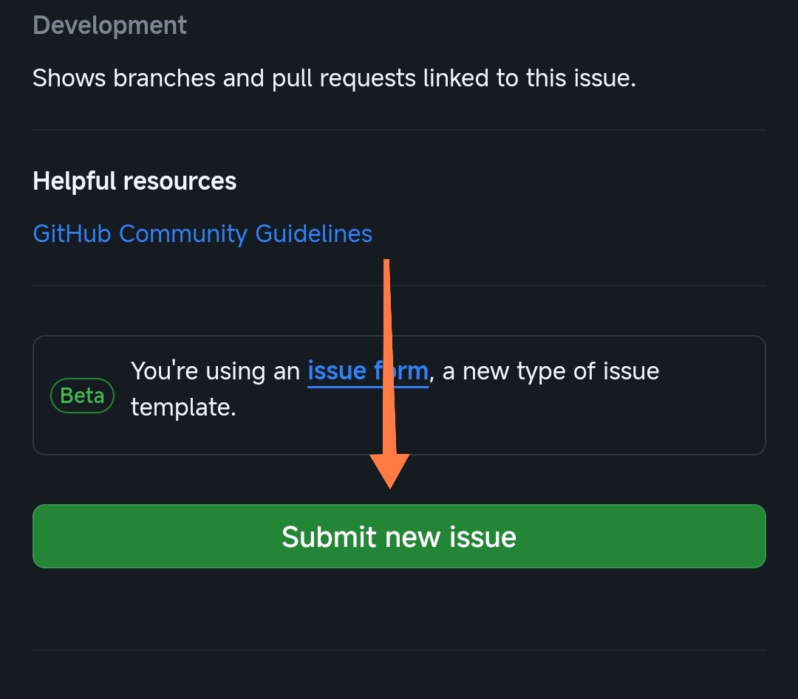
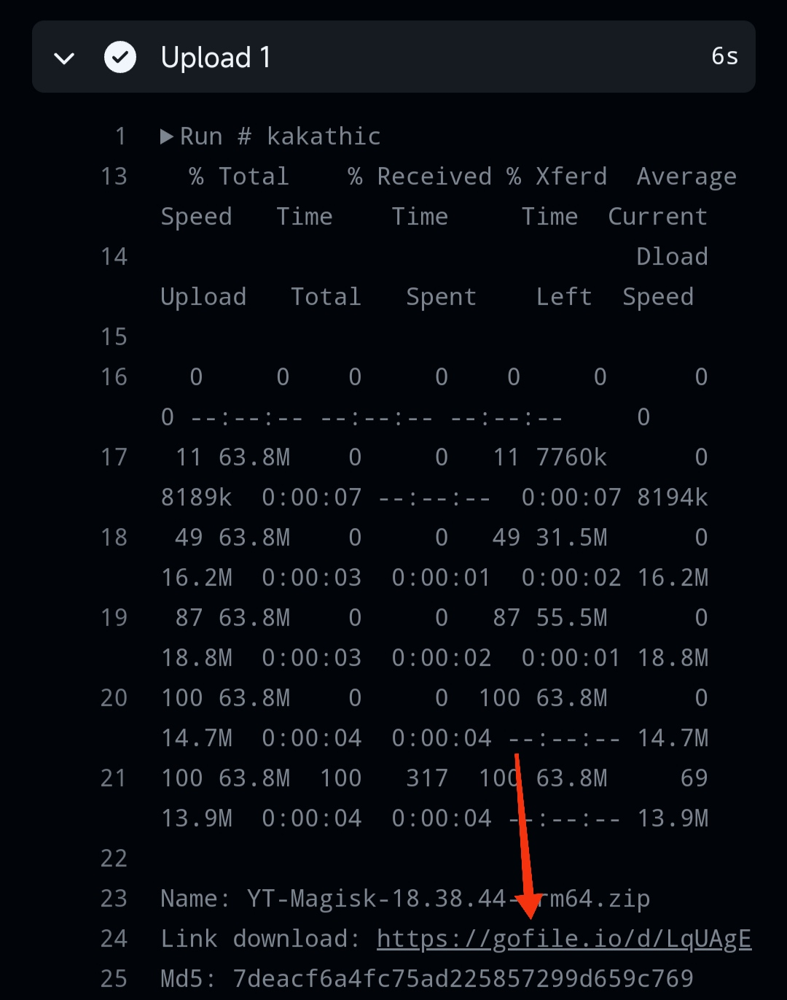

# Get Link

All links will be stored for 2 days

Currently supports the following get links

- Mega.nz
- Direct

Note: All files will be zip compressed, When downloading, unzip the zip to see the original file

User manual: [Actions](./actions)

See photo instructions

1. Select actions
2. Click on run workflow
3. Input link
4. Run workflow

Wait until green color appears 

Press to show the download link 

Click on view process to display server 1 link

